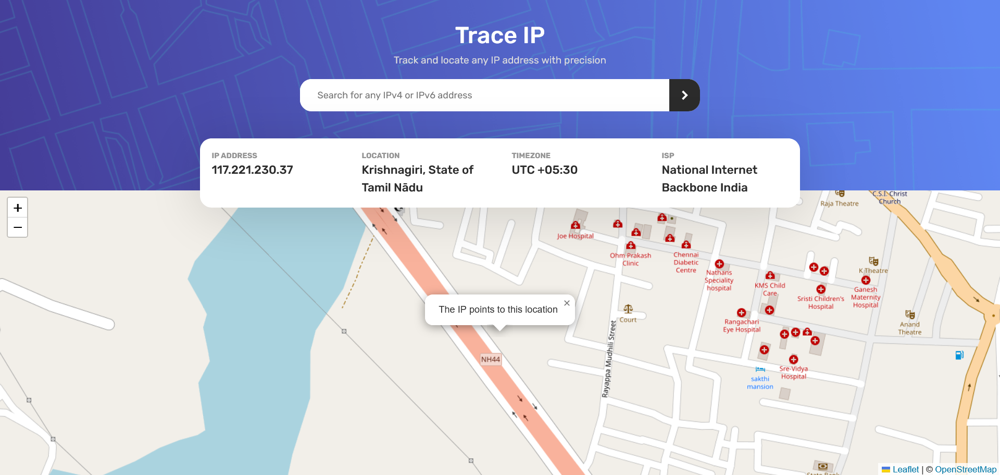

# Trace IP

A tool for tracing and analyzing IP addresses.

## Screenshot

## Description

This project provides functionality to trace IP addresses and the below mentioned information about the IP.

## Features

- IP address geolocation
- Map
- Timezone
- Internet Service Provider

## Requirements

- Node.js (v14 or higher recommended)

## License

MIT
